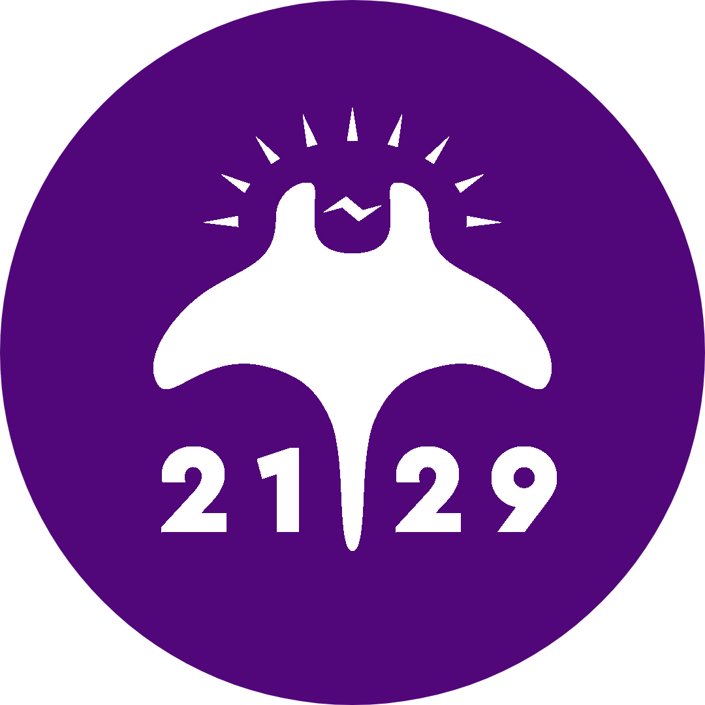

# TrentCAD

**Git-based CAD collaboration that hides Git behind a button.**

Built for FRC Team 2129 (Ultraviolet). SolidWorks-friendly. No CLI required.

[Download](#download) · [Features](#what-it-does) · [Why TrentCAD](#why-not-just-use-git) · [Developer docs](docs/DEVELOPMENT.md)

---

## What it does

TrentCAD is a desktop app that lets a robotics team collaborate on SolidWorks assemblies the same way developers collaborate on code — except your students never see a Git command. Under the hood it's Git + Git LFS + GitHub; on the surface it's **Download**, **Upload**, **Check Out**, and **Check In**.

- 🔒 **Check-out / check-in locks** on every CAD file so two students can't accidentally edit the same part at the same time. Backed by `git lfs lock`.
- 📁 **Auto part numbering** in your team's format (`YY-2129-XX-YYY`). New parts and assemblies are created pre-named — SolidWorks references never break from renames.
- 🔧 **SolidWorks task pane add-in** with the same buttons (Check Out / Check In / Sync / Publish) inside SolidWorks itself.
- 📊 **Build-season documents** generated from your CAD: Bill of Materials (CSV + PDF), Manufacturing Queue cut list (CSV + PDF), Project Summary with FRC 125 lb weight headroom (Markdown + PDF).
- 🛒 **Manufacturing queue** that groups released parts by method (3D Print / CNC / Manual / Other) and material — shop floor walks the queue in one direction.
- 🗂️ **COTS library support** — share a separate Git repo of off-the-shelf parts across all your team's robot projects.
- 🚦 **Pre-publish guards** catch giant non-LFS files *before* you waste an hour uploading something GitHub will reject.
- 🛠️ **Repository health scanner** lists every file over 50 MB with badges (`BLOCKER` / `WARNING` / `OK (LFS)`) so you can clean up before the build season crunch.
- 🔑 **Admin PIN gate** + install-wide settings baked from GitHub Actions secrets keeps team config consistent across student laptops.
- ☁️ **Optional Google Drive mirror** — one-way Git→Drive sync so non-CAD teammates can still read files in a browser.
- 🌐 **Self-hosted LFS storage** (opt-in) — point project LFS at your own server when GitHub's bandwidth quota gets tight.
- 🚀 **Auto-update** from GitHub Releases on Windows and Linux.

## Why not just use Git?

Because students who can build a swerve drive in CAD shouldn't have to learn to resolve a rebase conflict at 11 PM the night before competition.

TrentCAD trades Git's full power for one workflow that fits the way FRC teams actually work — and bakes in the FRC-specific bits Git doesn't know about: weight limits, manufacturing methods, part numbers, the shop's cut list, and the fact that some students design at home on their personal laptop while the rest of the team works on a school machine.

## Download

Latest installers are auto-built from `main`:

| Platform | Installer |
|---|---|
| **Windows** | [`.exe` from GitHub Releases](https://github.com/netarcx/TrentCAD/releases/latest) — auto-installs Git, Git LFS, and GitHub CLI via `winget` if missing |
| **macOS** | [`.dmg` from GitHub Releases](https://github.com/netarcx/TrentCAD/releases/latest) — Apple Silicon + Intel. Right-click → Open the first time (unsigned). Admin-only build, no SolidWorks add-in |
| **Linux** | [`.AppImage` from GitHub Releases](https://github.com/netarcx/TrentCAD/releases/latest) — `chmod +x` and run. Admin-only build, no SolidWorks add-in |

> **SolidWorks add-in** is auto-registered by the Windows installer. The Mac and Linux builds are intended for mentors and admin work — SolidWorks itself only runs on Windows.

## Quick start

1. **Download and install** TrentCAD for your platform.
2. **Sign in to GitHub** from the welcome screen (the installer already put `gh` CLI on your machine if winget was available).
3. Click **Create Project** to start a new robot, **Browse Projects** to list existing team repos, or **Join Project** to clone one by URL.
4. Open a CAD file in SolidWorks. **Check Out** before you edit it. **Check In** when you're done. **Upload** to push your changes for the rest of the team to see.

For a student-friendly walkthrough, see [docs/STUDENT_SETUP.md](docs/STUDENT_SETUP.md).

## Built for FRC teams

- **125 lb weight tracking** with live headroom callout on the status bar and in the auto-generated project summary
- **Per-part release workflow** (draft → in-review → released → manufactured) so mentors can sign off on parts before the shop cuts them
- **Mass + cost rollups** by subsystem and by manufacturing method, refreshed every five seconds while you work
- **Comments** thread per part — note your manufacturing tolerances, gotchas, or "do not edit until we settle the gear ratio"
- **Cascading check-out** for assemblies — checking out an `.sldasm` automatically locks every component it references
- **Weekly progress tags** for snapshotting CAD state at design-review milestones

## Documentation

- **[Developer docs (`docs/DEVELOPMENT.md`)](docs/DEVELOPMENT.md)** — architecture, dev setup, REST API reference, SolidWorks add-in build, Google Drive setup
- **[Student setup guide (`docs/STUDENT_SETUP.md`)](docs/STUDENT_SETUP.md)** — getting students onto the team's CAD repo
- **Built-in onboarding tour** runs the first time you open the app

## Contributing

This is a small project built for one FRC team, but PRs and issues are welcome — especially if you're running TrentCAD for your own team and have hit a wall.

## License

Source-available for FRC team use. No license file is currently included — if you're a mentor on another team interested in using TrentCAD, open an issue and we'll talk.
